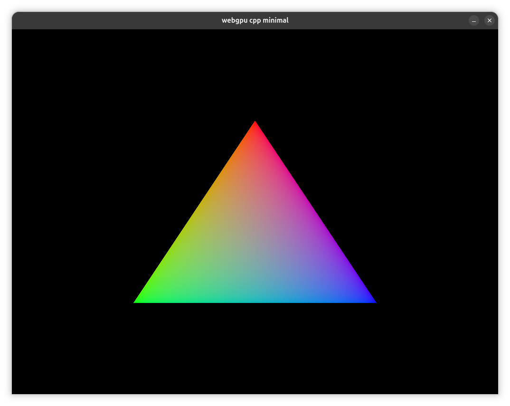

# webgpu-cpp-minimal

A minimal, cross-platform WebGPU application built in C++ using the `webgpu-native` implementation.

A minimal webgpu app in C++ using webgpu-native.
This project shows how to create a simple and minimal application with webgpu using webgpu-native implementation in C++.
It contains CI / CD that enable to build and run this app on windows, linux and macOS.

# Features

 - **Lightweight Setup:** A clean and straightforward boilerplate demonstrating how to initialize and run WebGPU in C++ with:
    - GLFW-based window creation
    - Simple, standard WebGPU render pipeline
    - Renders a basic triangle
 - **Cross-Platform CI/CD:** Automated build and execution pipelines configured for **Windows**, **Linux**, and **macOS**:
    - Builds binaries for windows, linux, and macOS on every push
    - Packages and publishes build artifacts when a tag is created
    - Run app to verify that it is working properly

# Dependencies

This project is built using the following core dependencies:

 - [WebGPU Distribution](https://github.com/eliemichel/WebGPU-distribution) (v0.2.0, powered by wgpu-native v0.19.4.1)
 - [GLFW WebGPU Extension](https://github.com/eliemichel/glfw3webgpu) (v1.2.0)

# Linux (Debian / Ubuntu)

## Prerequisites

Eventually install if missing:

`sudo apt-get install -y build-essential cmake libxkbcommon-dev libxinerama-dev libxcursor-dev libxi-dev`

## Build & Run

`cmake -B build && cmake --build build --parallel && ./build/webgpu_cpp_minimal`